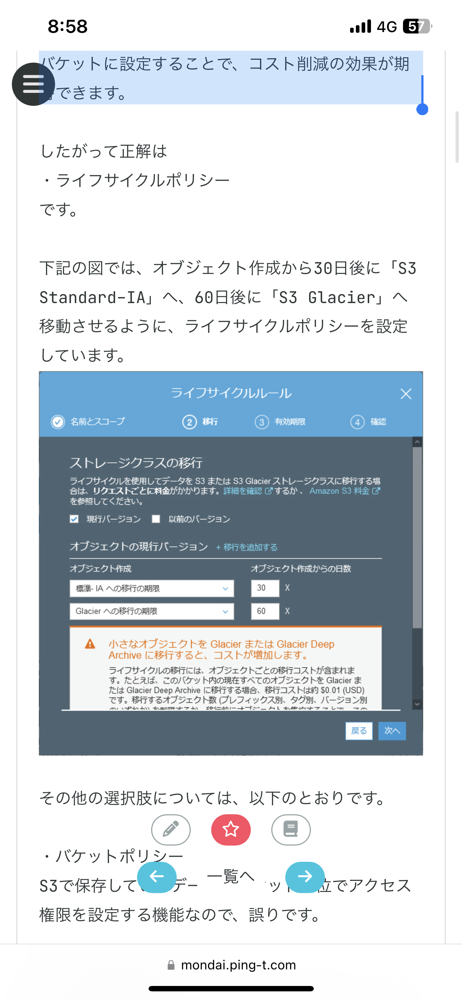

# AWS 勉強まとめ

## AWSの責任分担について

### ユーザーが責任を持つもの

- AWSサービスを利用するにあたって作成した認証情報
- AWSサービスへのアクセス権限
- AWSサービス上のユーザーデータやログ
- ゲストOS※のパッチ適用、セキュリティ対策
「ゲストOS」とはハイパーバイザー（ホストOS）の仮想環境上で動作するOSのこと

### インスタンスストア vs  EBS

```
インスタンスストアは、EC2インスタンスから利用できる揮発性の（インスタンス稼働中にだけ利用可能な）ブロックストレージです。利用料金はEC2に含まれているため、インスタンスストア自体は無料で使用できます。
```

インスタンスストアは、Amazon EBS（Elastic Block Store）が登場する以前にEC2のデフォルトストレージとして使用されていました。揮発性のストレージであり、また冗長構成ではないため、EC2インスタンスの停止・終了（削除）時や障害発生時にはデータが失われます。一方、EBSよりも高いパフォーマンスを発揮できるという特徴があります。


### オブジェクトロック

- **リーガルホールド** →  保持期間無制限
  
- **リテンションモード** → 期限付き
  - **ガバナンスモード**

  ```
  権限（s3:BypassGovernanceRetention）を持たないユーザーに対して、指定した保持期間中オブジェクトを読み取り専用にします。権限を持つユーザーのみオブジェクトの更新・削除と、ガバナンスモードの解除ができます。
  ```
  - **コンプライアンスモード**

  ```
  ルートユーザーを含む全てのユーザーに対して、指定した保持期間中オブジェクトを読み取り専用にします。保持期間中はルートユーザーを含めてコンプライアンスモードを解除できません。
  ```

### S3の用語

- ライフサイクルポリシー
```
S3バケット内のデータに対して、ストレージクラスの変更やオブジェクトの削除を自動化する機能です。指定した期間が経過したデータを自動的に、よりコストパフォーマンスの高いストレージへ移動したり、保管期限の過ぎたデータを削除したりできます。アクセス頻度が予測できるデータや、保管期間が決められているデータのバケットに設定することで、コスト削減の効果が期待できます。
```

- バケットポリシー
```
S3で保存しているデータにバケット単位でアクセス権限を設定する機能
```
- バージョニング
```
オブジェクトの世代管理ができる機能
```

### インスタンスファミリー


### ハードウェア専有 vs Dedicated Host


### Iaas vs Paas


### NACL（ネットワークACL） vs セキュリティグループ

NACL
ステートレス（インバウンド通信、アウトバウンド通信どちらも許可が必要）

セキュリティグループ
ステートフル（アウトバウンド通信を許可すれば　インバウンド通信も自動的に許可される）

### ルートテーブル

ルートテーブルはVPC内の通信に対してデータをどこに転送するかを定義する機能です。ルートテーブルに従って、送信先ごとに指定したターゲットへデータを転送することを「ルーティング」といいます。各サブネットは1つのルートテーブルを紐付けることができ、ルートテーブルの紐付けがないサブネットはVPC全体に適用される「メインルートテーブル」に従ってルーティングを行います。

ルートテーブルはVPCからインターネットへ接続する時も使用します。ターゲットをインターネットゲートウェイに設定すると、サブネット内に発生した送信先がVPC外への通信をインターネットゲートウェイへ転送して、インターネットへ接続できるようになります

### Egress-Onlyインターネットゲートウェイ

NATゲートウェイとインターネットゲートウェイの特徴を併せ持つIPv6専用の機能です。インターネットからVPCへ（Ingress）の接続開始要求は通さず、VPCからインターネットへ（Egress）の接続開始要求は通します。


